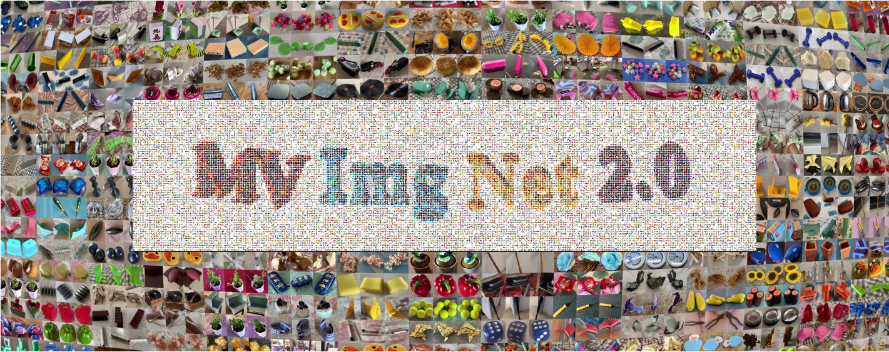

# MVImgNet2.0: A Larger-scale Dataset of Multi-view Images


by Xiaoguang Han*#, Yushuang Wu*, Luyue Shi*, Haolin Liu*, Hongjie Liao, Lingteng Qiu, Weihao Yuan, Xiaodong Gu, Zilong Dong, Shuguang Cui from [GAP-Lab](https://gaplab.cuhk.edu.cn/).

## Introduction

MVImgNet2.0 contains ∼300k real-world objects in 340+ classes, expands [MVImgNet](https://github.com/GAP-LAB-CUHK-SZ/MVImgNet) to a total of ~520k real-life objects and 515 categories. The annotation comprehensively covers object masks, camera parameters, and point clouds.

Please fill out this [form](https://forms.office.com/Pages/ResponsePage.aspx?id=eouJ5YecS0qyKi3z81XgHtu64XHwYCVMlIWpSlrs63lUNzNHV1pYR0lBUEtET1JGWTEzVTdVVUoyVy4u) to get the download link and password.

### Updates

- We have released the first part of MVImgNet2.0, which contains ~180k videos. Please fill out the above form to get the download links. We will release the remaining videos recently.

### Folder structure
```
|-- ROOT
    |-- class_label
        |-- instance_id
            |-- images
            |-- masks
            |-- sparse/0 # camera parameters and sparse point clouds in colmap format
                |-- cameras.bin   
                |-- images.bin    
                |-- points3D.bin   
```

The mapping between `class_label` and class name can be found in `mvimgnet2_category.json` (The json file contains all the categories of MVImgNet and MVImgNet2.0, to use the data of MVImgNet, please refer to [MVImgNet](https://github.com/GAP-LAB-CUHK-SZ/MVImgNet) for dataset download).

## License

The data is released under the MVImgNet2.0 Terms of Use, and the code is released under the Attribution-NonCommercial 4.0 International License.

Copyright (c) 2024